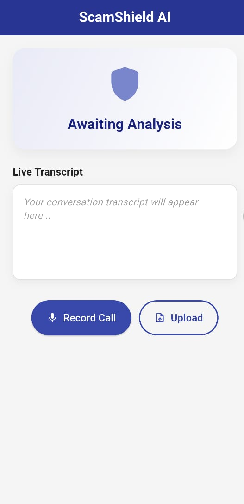
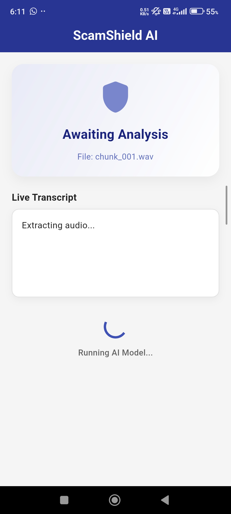
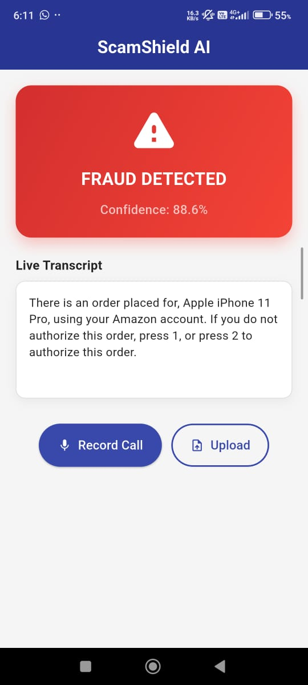
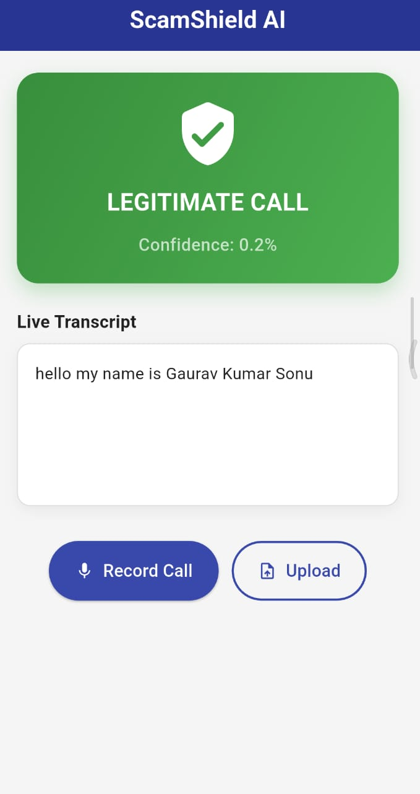

# ScamShield 🛡️

ScamShield is a Flutter app that helps users spot potentially fraudulent calls using on-device speech-to-text, local preprocessing, and TensorFlow Lite inference.

It supports two analysis modes:

- 🎙️ Live microphone recording for near real-time speech capture
- 📂 Audio file upload for offline transcription and analysis

Once the transcript is ready, the app normalizes the text, converts it into token IDs, and runs a local ML model to produce a fraud risk score with confidence.

## Overview ✨

ScamShield is built as a simple, mobile-first fraud call detection assistant. The experience stays focused on one guided flow so users can record, upload, and review results without getting lost in menus.

Core output labels:

- 🔴 FRAUD DETECTED
- 🟢 LEGITIMATE CALL

## Why This App Stands Out 🚀

- 🎧 Live speech capture using `speech_to_text`
- 🧠 Offline audio transcription using `whisper_flutter_new`
- ⚡ On-device fraud classification using `tflite_flutter`
- 🧹 Local vocabulary-based preprocessing
- 📊 Confidence score display with clear visual feedback
- 📁 File upload support for existing recordings
- 📱 Responsive, single-screen Flutter UI

## Demo Preview 🖼️

### App Screenshots

Explore the app's intuitive interface with these preview images:

<table>
  <tr>
    <td align="center"><b>Home Screen</b></td>
    <td align="center"><b>Recording View</b></td>
    <td align="center"><b>Fraud Detection</b></td>
  </tr>
  <tr>
    <td></td>
    <td></td>
    <td></td>
  </tr>
  <tr>
    <td align="center"><b>Legitimate Call</b></td>
    <td align="center"><b>App Logo</b></td>
    <td></td>
  </tr>
  <tr>
    <td></td>
    <td></td>
    <td></td>
  </tr>
</table>

## APK Download 📦

Place the compiled app APK here and link it from this section.

- Latest APK: [Download ScamShield APK](https://drive.google.com/file/d/1t6CsKAp5nkWFd2WoZ5XIvlZcjvjsJsEc/view?usp=drive_link)

## Frontend Summary 🎨

The Flutter frontend is designed to make fraud detection fast and easy for non-technical users. The interface uses a focused layout with one main screen, clear action buttons, and result cards that update immediately after analysis.

Highlights from the UI/UX approach:

- Simple, task-focused interaction flow
- Mobile-first layout with responsive controls
- Semantic result colors for high-risk and safe outcomes
- Immediate loading and feedback states
- Clear transcript presentation for user review

## Technology Stack 🧰

- Flutter / Dart
- Material Design UI components
- `speech_to_text` for microphone input
- `whisper_flutter_new` for offline transcription
- `tflite_flutter` for local inference
- `file_picker` for selecting audio files
- `permission_handler` for runtime permissions
- `path_provider` for local file access

## How It Works 🔍

1. User records speech or uploads an audio file.
2. The app converts audio into transcript text.
3. The transcript is cleaned and tokenized.
4. Tokens are converted into a fixed-length sequence.
5. The TensorFlow Lite model produces a fraud score.
6. The UI shows the final label and confidence.

## Project Architecture 🧱

### Core Files

- [lib/main.dart](lib/main.dart) - app entry point and MaterialApp setup
- [lib/screens/home_screen.dart](lib/screens/home_screen.dart) - main UI and user flow
- [lib/services/preprocessor.dart](lib/services/preprocessor.dart) - text cleanup and token sequence generation
- [lib/services/classifier.dart](lib/services/classifier.dart) - model loading and inference

### Model Assets

- [assets/models/fraud_model.tflite](assets/models/fraud_model.tflite)
- [assets/models/vocab.json](assets/models/vocab.json)
- [assets/models/ggml-tiny.en.bin](assets/models/ggml-tiny.en.bin)

## UI Structure 🧭

The current frontend uses a single-screen flow with these main sections:

- Header and app summary
- Result card with fraud or legitimate state
- Transcript panel
- Input controls for recording and upload
- Status feedback for loading and errors

## Setup 🛠️

### Prerequisites

- Flutter SDK
- Dart SDK compatible with the project environment
- Android Studio, Xcode, or platform tools for your target device
- A physical device is recommended for microphone testing

### Install Dependencies

```bash
flutter pub get
```

### Run the App

```bash
flutter run
```

### Build the APK

```bash
flutter build apk --release
```

The release APK will be generated under the Flutter build output directory.

## Permissions and Platform Notes 📌

### Android

The Android manifest includes permissions for:

- Microphone access
- File access
- Internet access

## Model and Data Notes 🧬

ScamShield uses a local ML pipeline, so prediction quality depends on keeping the preprocessing and model assets aligned.

If you update the model, make sure these stay in sync:

- `assets/models/fraud_model.tflite`
- `assets/models/vocab.json`
- preprocessing logic in `lib/services/preprocessor.dart`

The current pipeline uses a fixed sequence length of 60 tokens.

## Testing ✅

```bash
flutter test
```

The default widget test is still a template-style test, so it does not fully cover the fraud detection flow yet.

## Troubleshooting 🧩

- Model not loaded
  - Confirm the TFLite model exists in `assets/models/` and is listed in `pubspec.yaml`.

- Transcription failed
  - Confirm the Whisper model asset exists and the app has the required storage and microphone permissions.

- No speech recognized
  - Check microphone permissions and try again in a quieter environment.

- Poor prediction quality
  - Make sure the vocabulary matches the training vocabulary and that preprocessing matches the model expectations.

## Current Limitations ⚠️

- Binary classification only
- No history or session tracking
- Limited automated coverage for ML and UI flows
- Designed primarily for English transcription and inference

## Future Improvements 🌱

- Add test coverage for preprocessing and inference
- Add history and analytics screens
- Add explainability or keyword highlighting
- Add adjustable threshold settings
- Add optional cloud sync for reports

